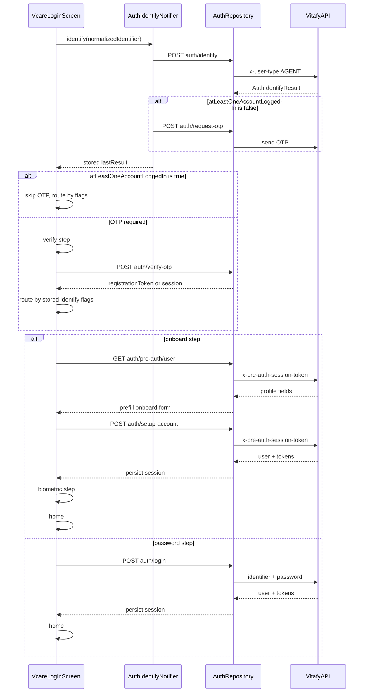

# Auth Identify + OTP Flow

This document describes the agent app authentication flow for phone/email login using the Vitafy v4 auth APIs.

## APIs

All endpoints are under `{BASE_URL}api/v1/` (the app appends `api/v1/` for every flavor).

Dev example:

```env
BASE_URL=https://dev-api-v4.vitafyhealth.com/
```

Resolves to:

```text
https://dev-api-v4.vitafyhealth.com/api/v1/auth/identify
```

Every auth call requires:

```http
Content-Type: application/json
x-user-type: AGENT
```

### 1. Identify

```bash
curl --location 'https://dev-api-v4.vitafyhealth.com/api/v1/auth/identify' \
  --header 'Content-Type: application/json' \
  --header 'x-user-type: AGENT' \
  --data-raw '{"identifier": "user@example.com"}'
```

Response:

```json
{
  "success": true,
  "message": "Identification completed",
  "data": {
    "userExists": false,
    "multipleAccounts": false,
    "atLeastOneAccountLoggedIn": false,
    "otherPendingAccount": false,
    "otpSend": true
  }
}
```

### 2. Request OTP (conditional)

Called when `atLeastOneAccountLoggedIn` is `false` after identify.

```bash
curl --location 'https://dev-api-v4.vitafyhealth.com/api/v1/auth/request-otp' \
  --header 'Content-Type: application/json' \
  --header 'x-user-type: AGENT' \
  --data-raw '{"identifier": "user@example.com"}'
```

Also used for resend on the verify screen.

### 3. Verify OTP

```bash
curl --location 'https://dev-api-v4.vitafyhealth.com/api/v1/auth/verify-otp' \
  --header 'Content-Type: application/json' \
  --header 'x-user-type: AGENT' \
  --data-raw '{"identifier": "user@example.com", "otp": "123456"}'
```

If the response includes session tokens (`access`, `refresh`, `user_id`), they are persisted to local storage.

For new users (`!userExists`), the metadata-only response returns a `registrationToken` used by setup-account:

```json
{
  "success": true,
  "message": "OTP verified successfully",
  "data": {
    "registrationToken": "<jwt>"
  }
}
```

### 3.5 Pre-auth User

Called immediately after OTP verification when routing to the onboard step. Uses the `registrationToken` from verify-otp as the pre-auth session token.

```bash
curl --location 'https://dev-api-v4.vitafyhealth.com/api/v1/auth/pre-auth/user' \
  --header 'x-user-type: AGENT' \
  --header 'x-pre-auth-session-token: <registrationToken>'
```

Response (unwrapped `data`):

```json
{
  "firstName": "Jane",
  "lastName": "Doe",
  "dob": "1990-01-15",
  "zipCode": "12345",
  "email": "user@example.com",
  "phone": "+15551234567"
}
```

Fields may be partial or omitted. The app prefills only non-empty values into the onboard form. Password fields are never prefilled.

### 4. Setup Account

Called from the onboard step after OTP verification for new users.

```bash
curl --location 'https://dev-api-v4.vitafyhealth.com/api/v1/auth/setup-account' \
  --header 'Content-Type: application/json' \
  --header 'x-user-type: AGENT' \
  --header 'x-pre-auth-session-token: <registrationToken>' \
  --data-raw '{
    "firstName": "Jane",
    "lastName": "Doe",
    "password": "Password1!",
    "dob": "1990-01-15",
    "zipCode": "12345",
    "email": "user@example.com",
    "phone": "+15551234567",
    "tenantSlug": "default"
  }'
```

Response (unwrapped `data`):

```json
{
  "user": { "id": "<uuid>", "email": "...", "firstName": "...", "lastName": "..." },
  "tokens": { "accessToken": "...", "refreshToken": "..." },
  "menu": ["files", "activities"]
}
```

On success, access/refresh tokens and user profile id are persisted. The user continues to the biometric step, then navigates to Home.

### 5. Login (password)

Called from the password step after identify when `userExists == true` and `atLeastOneAccountLoggedIn == true` (OTP skipped), or after OTP verification routes to the password step.

```bash
curl --location 'https://dev-api-v4.vitafyhealth.com/api/v1/auth/login' \
  --header 'Content-Type: application/json' \
  --header 'x-user-type: AGENT' \
  --data-raw '{
    "identifier": "user@example.com",
    "password": "Password1!"
  }'
```

Response (unwrapped `data`):

```json
{
  "user": {
    "id": "<uuid>",
    "firstName": "Jane",
    "lastName": "Doe",
    "email": "user@example.com"
  },
  "tokens": {
    "accessToken": "...",
    "refreshToken": "..."
  },
  "menu": ["files", "activities"]
}
```

On success, `accessToken`, `refreshToken`, `user.id` (profile id), email, and username are persisted to local storage. The user navigates to Home.

## Sequence



## Identifier normalization

| Method | Rule | Example input | Sent value |
|--------|------|---------------|------------|
| Phone | Digits only | `(555) 123-4567` | `5551234567` |
| Email | Trim + lowercase | ` User@Example.com ` | `user@example.com` |

Implementation: `AuthIdentifierNormalizer` in `lib/features/auth/domain/auth_identifier_normalizer.dart`.

## Navigation policy

### Pre-OTP (after identify)

| Condition | Action |
|-----------|--------|
| `atLeastOneAccountLoggedIn == false` | Chain `request-otp`, then go to verify |
| `atLeastOneAccountLoggedIn == true` | Skip OTP; route directly using post-OTP policy |

### Post-OTP (after verify, or skip-OTP path)

Priority order in `AuthLoginNavigationPolicy.resolvePostOtpStep`:

| Priority | Condition | Login step |
|----------|-----------|------------|
| 1 | `atLeastOneAccountLoggedIn` | password |
| 2 | `!userExists` | onboard |
| 3 | `multipleAccounts` | disambiguate |
| 4 | `userExists` (no login yet) | activateDetails |

## State persistence

`AuthIdentifyState.lastResult` stores the identify response until the user navigates back from verify to identify (then cleared).

## Code map

| Layer | Files |
|-------|-------|
| Domain | `auth_identify_result.dart`, `auth_identify_account.dart`, `auth_verify_otp_result.dart`, `auth_pre_auth_user.dart`, `auth_setup_account_result.dart`, `auth_login_navigation_policy.dart`, `auth_identifier_normalizer.dart`, `auth_phone_formatter.dart` |
| Data | `auth_identify_result_model.dart`, `auth_login_result_model.dart`, `auth_verify_otp_result_model.dart`, `auth_pre_auth_user_model.dart`, `auth_setup_account_result_model.dart`, `auth_repository_impl.dart`, `auth_api_headers.dart` |
| Presentation | `auth_identify_state_provider.dart`, `auth_verify_otp_state_provider.dart`, `auth_pre_auth_user_state_provider.dart`, `auth_setup_account_state_provider.dart`, `login_request_state_provider.dart`, `vcare_login_screen.dart` |

## Open questions / follow-ups

- Account list source for `disambiguate` and `activate` steps (identify `accounts[]` is parsed but not yet used for those steps).
- Forgot-password flow in `VcareLoginScreen` still uses mock lookup.
- Social login buttons still use mock sign-in.
