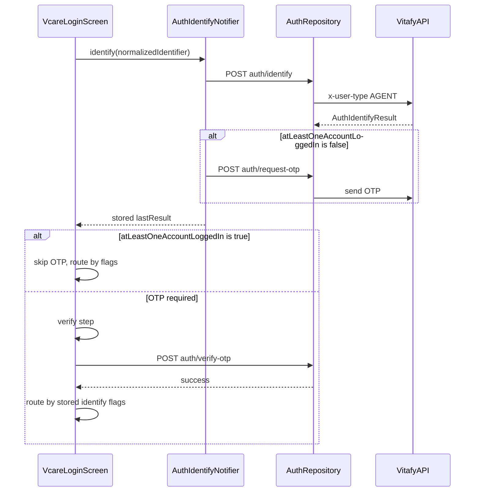

# Auth Identify + OTP Flow

This document describes the agent app authentication flow for phone/email login using the Vitafy v4 auth APIs.

## APIs

All endpoints are under `{BASE_URL}api/v1/` (the app appends `api/v1/` for every flavor).

Dev example:

```env
BASE_URL=https://dev-api-v4.vitafyhealth.com/
```

Resolves to:

```text
https://dev-api-v4.vitafyhealth.com/api/v1/auth/identify
```

Every auth call requires:

```http
Content-Type: application/json
x-user-type: AGENT
```

### 1. Identify

```bash
curl --location 'https://dev-api-v4.vitafyhealth.com/api/v1/auth/identify' \
  --header 'Content-Type: application/json' \
  --header 'x-user-type: AGENT' \
  --data-raw '{"identifier": "user@example.com"}'
```

Response:

```json
{
  "success": true,
  "message": "Identification completed",
  "data": {
    "userExists": false,
    "multipleAccounts": false,
    "atLeastOneAccountLoggedIn": false,
    "otherPendingAccount": false,
    "otpSend": true
  }
}
```

### 2. Request OTP (conditional)

Called when `atLeastOneAccountLoggedIn` is `false` after identify.

```bash
curl --location 'https://dev-api-v4.vitafyhealth.com/api/v1/auth/request-otp' \
  --header 'Content-Type: application/json' \
  --header 'x-user-type: AGENT' \
  --data-raw '{"identifier": "user@example.com"}'
```

Also used for resend on the verify screen.

### 3. Verify OTP

```bash
curl --location 'https://dev-api-v4.vitafyhealth.com/api/v1/auth/verify-otp' \
  --header 'Content-Type: application/json' \
  --header 'x-user-type: AGENT' \
  --data-raw '{"identifier": "user@example.com", "otp": "123456"}'
```

If the response includes session tokens (`access`, `refresh`, `user_id`), they are persisted to local storage.

## Sequence



## Identifier normalization

| Method | Rule | Example input | Sent value |
|--------|------|---------------|------------|
| Phone | Digits only | `(555) 123-4567` | `5551234567` |
| Email | Trim + lowercase | ` User@Example.com ` | `user@example.com` |

Implementation: `AuthIdentifierNormalizer` in `lib/features/auth/domain/auth_identifier_normalizer.dart`.

## Navigation policy

### Pre-OTP (after identify)

| Condition | Action |
|-----------|--------|
| `atLeastOneAccountLoggedIn == false` | Chain `request-otp`, then go to verify |
| `atLeastOneAccountLoggedIn == true` | Skip OTP; route directly using post-OTP policy |

### Post-OTP (after verify, or skip-OTP path)

Priority order in `AuthLoginNavigationPolicy.resolvePostOtpStep`:

| Priority | Condition | Login step |
|----------|-----------|------------|
| 1 | `!userExists` | onboard |
| 2 | `otherPendingAccount` | activate |
| 3 | `multipleAccounts` | disambiguate |
| 4 | default | password |

## State persistence

`AuthIdentifyState.lastResult` stores the identify response until the user navigates back from verify to identify (then cleared).

## Code map

| Layer | Files |
|-------|-------|
| Domain | `auth_identify_result.dart`, `auth_verify_otp_result.dart`, `auth_login_navigation_policy.dart`, `auth_identifier_normalizer.dart` |
| Data | `auth_identify_result_model.dart`, `auth_verify_otp_result_model.dart`, `auth_repository_impl.dart`, `auth_api_headers.dart` |
| Presentation | `auth_identify_state_provider.dart`, `auth_verify_otp_state_provider.dart`, `vcare_login_screen.dart` |

## Open questions / follow-ups

- Exact `verify-otp` response schema when no tokens are returned (metadata-only path).
- Account list source for `disambiguate` and `activate` steps (not present in identify response today).
- Forgot-password flow in `VcareLoginScreen` still uses mock lookup.
- Social login buttons still use mock sign-in.
